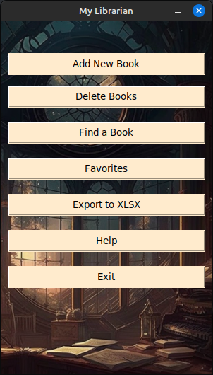
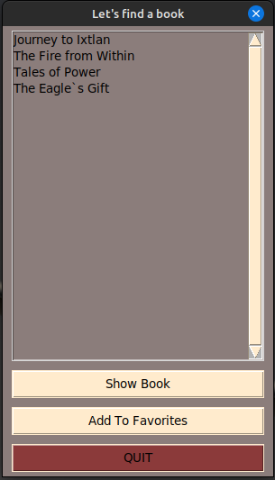

# "MY LIBRARIAN"

 

## Small application with GUI to manage your electronic books collection as library

### Application fitures

<<<<<<< HEAD
  
=======
 
>>>>>>> fe403f9 (modified readme)

DATABASE: [ebook_sql_db.py](https://github.com/ViolinaS/my-librarian/blob/main/ebook_sql_db.py)

* All information about e-books is stored in the SQLite database.
* There are 4 tables in the [database](https://github.com/ViolinaS/my-librarian/blob/main/ebook_sql_db.py): books, authors, favorite_shelf, genres.

Database relations mapping:

